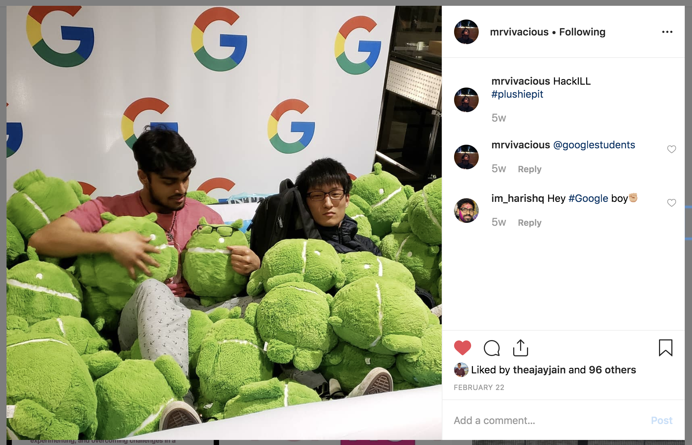

# Conscious_consumer

Welcome! This tutorial was designed for the attendees of the University of Illinois' <a href="https://sail.cs.illinois.edu/">CS@ILLINOIS SAIL</a>, an event for high school students to explore various student-led classes at the University.
   However, this tutorial is meant for anyone to use ~

### Who?

You - the person who browses the internet and consumes information in the way the info-providers present it
 Website hosts - the entities that organize information, specify how it should look in the best way that makes sense 
  to them, and deliver the website content to users

### What?

  As website hosts determine how information is presented, we as consumers may not always find the information we want in a quick manner, be faced with difficult-to-navigate layouts, find unwanted elements..., and so on. 
   
  However, with a little bit of JavaScript, we will find that we can customize the way websites present themselves, enabling us to levels of customization that benefit ourselves and our purposes ~

For instance, I didn't like seeing "likes" on social media, so I <a href="https://chrome.google.com/webstore/detail/likefree/hejgbghjhjiilikhjinpbooockoiipek">built an app that hides the likes</a>. Here is a demo using Instagram:

Without browser modifications | After browser modifications
:-:|:-:
  |  

### Where?

Directly inside your browser, via a Chrome extension

### When?

Anytime you're on the website the script was written for, anytime a particular event triggers the script (as you configured)...if you can find a way to trigger the script when you want it to run, that's when it runs :)

### Why?

I built <a href="https://play.google.com/store/apps/details?id=com.mrvivacious.android.fortuneballll">an app that generates a positive/good vibes message that I can share</a> but I didn't like how long the process took. I recently started building with Alexa and I thought it would be a much faster solution to my problem while being an opportunity to increase my Alexa skillset.
For you, this can help provide insight into connecting AWS SNS with AWS Lambda and the Alexa Voice Service.
  
  After building the extension to hide likes and spending more time with web development, I noticed that essentially all compononents of any site could be manipulated to suit the user's desires. With this knowledge, customizing the way you consume the web can influence the way you process information, interact with websites, restructure the ways websites present content, and <a href="https://chrome.google.com/webstore/detail/porno-porn-blocker-beta/fnfchnplgejcfmphhboehhlpcjnjkomp">much, much more</a>.

### <a href="https://github.com/mrvivacious/AWS_Lambda_and_SNS/blob/master/page0.md">How [next page]</a>?

* Sources for the images: screenshots by David Wang (davidw1339) and Vivek Bhookya (mrvivacious)

